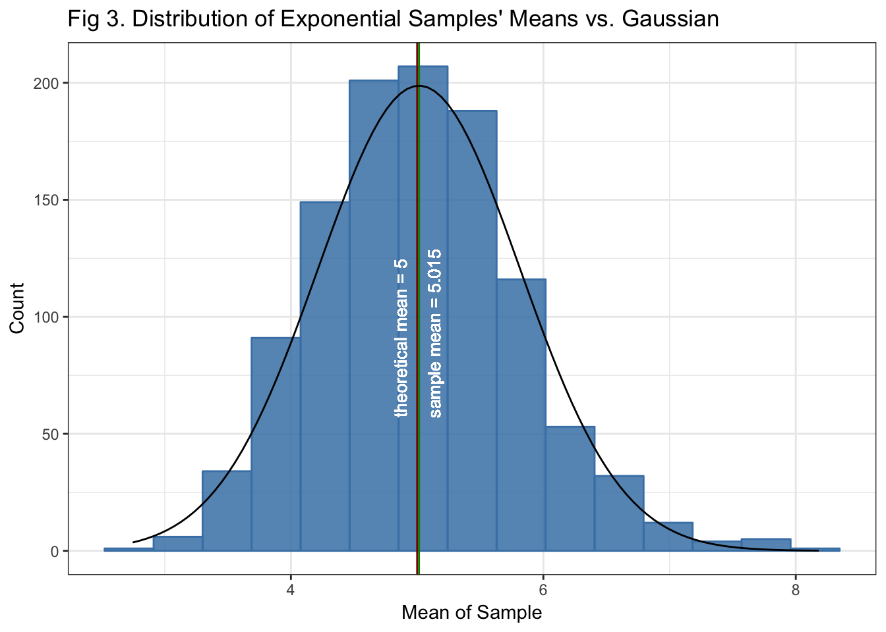

 
[**CLICK HERE**](https://reyvaz.github.io/CLT-LLN-Simulations/clt_lln.html)
to see full analysis in html

## Central Limit Theorem and Law of Large Numbers via Exponential and Poisson Simulations

Analyses the Law of Large Numbers and the Central Limit Theorem using 
exponential and Poisson simulations in R. 

* The rendered html version can be found
[here](https://reyvaz.github.io/CLT-LLN-Simulations/clt_lln.html).   

* To reproduce simply run the [clt_lln.Rmd](clt_lln.Rmd) script. 

[GitHub Pages](https://reyvaz.github.io/CLT-LLN-Simulations/)  
  

  